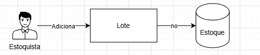
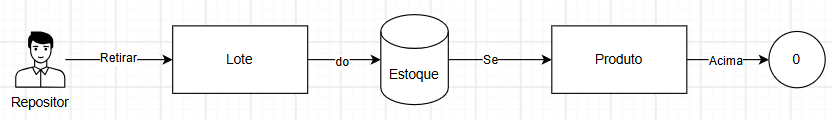
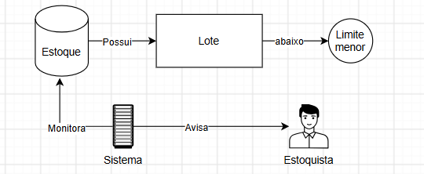
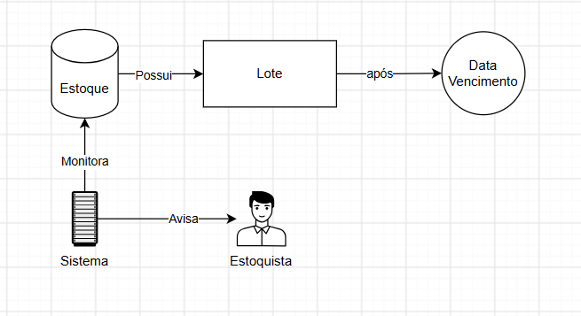
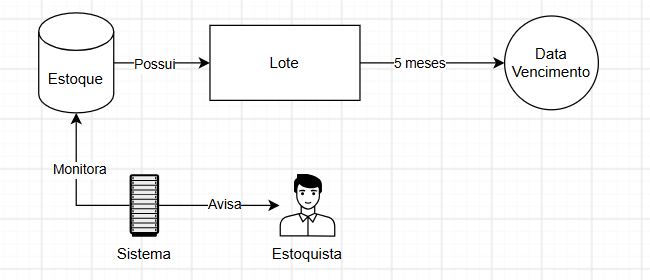
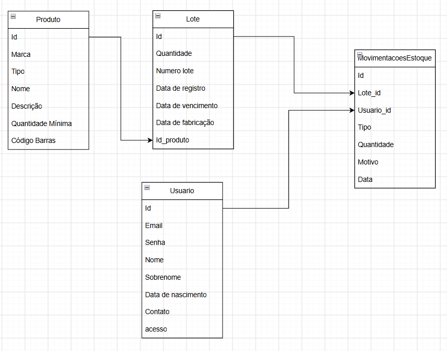

# Projeto de gerenciamento de estoque

Este é um projeto básico de gerenciamento de estoque, o motivo deste projeto é aprofundar os conhecimentos de desenvolvimento web com as seguintes tecnologias:

-   Python
-   FastApi
-   PostgreSQL
-   SQLAlchemy 2X

## Arquitetura
Este projeto está sendo desenvolvido como um monolito.

## Regras Mapeadas

Abaixo seguem as imagens das regras mapeadas, e quaisquer alterações serão documentadas por meio da adição de novos diagramas sem excluir o original para mostrar a evolução do sistema.

### Regras de estoque

- Adicionar estoque

  

- Retirar estoque

  

- Monitorar quantidade

  

- Controle de vencimento

  

- Regra de 5 meses

  

## Desenho BD
Abaixo segue o schema inicial do banco de dados relacional

- Schema

  

# Evoluções

Esta seção irá englobar as evoluções de modelagem durante o processo.
